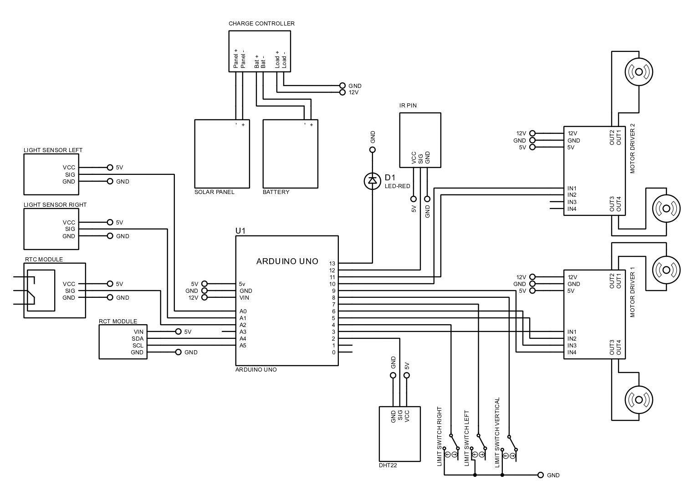

# Automatic Smart Blinds with Tri-Color Light System

This project is an Arduino-based **smart blinds automation system** that adjusts window blinds based on environmental conditions such as **light intensity, temperature, and time of day**. It also includes **manual control via IR remote** and a **tri-color lighting system** for indoor illumination control.

---

## Project Overview

The system integrates multiple sensors and actuators to create a fully automated smart window solution. It controls:

- horizontal blinds (left and right panels)  
- vertical blinds (open, mid, close positions)  
- indoor lighting (tri-color levels)  

The system operates in both:
- **Automatic Mode** (sensor + time-based)
- **Manual Mode** (IR remote control)

---

## Features

### ☀️ Light-Based Automation
- Uses dual LDR sensors (left & right)
- Detects sunlight intensity and direction
- Automatically:
  - opens blinds when light is low  
  - closes blinds when light is too strong  

---

### 🌡️ Temperature-Based Control
- Uses **DHT22 sensor**
- Adjusts vertical blinds depending on temperature:
  - High temp → close blinds  
  - Medium temp → partial (middle)  
  - Low temp → open blinds  

---

### ⏰ Time-Based Logic
- Uses **DS3231 RTC module**
- Restricts automatic vertical adjustment to daytime (e.g., 9 AM – 5 PM)

---

### 💡 Tri-Color Lighting System
- Controlled via relay pulses
- Supports multiple brightness levels:
  - Off  
  - Low  
  - Medium  
  - Bright  

Automatically adjusts lighting based on ambient light levels.

---

### 🎮 IR Remote Control (Manual Mode)
- Allows user to:
  - toggle automatic/manual mode  
  - open/close left blinds  
  - open/close right blinds  
  - adjust vertical blinds (up/down)  
  - switch lighting modes  

---

### 🛑 Limit Switch Safety
- Prevents over-travel of motors  
- Ensures blinds stop at:
  - left limit  
  - right limit  
  - vertical limit  

---

## System Workflow

### 1. Initialization
- System resets blinds to default positions using limit switches  
- Sets initial states:
  - blinds open  
  - lighting off  

---

### 2. Automatic Mode

Runs every minute:
- Reads:
  - light levels (LDR)
  - temperature (DHT22)
  - current time (RTC)

#### Light Logic
- Bright → close blinds  
- Medium → adjust lighting level  
- Dark → open blinds and increase lighting  

#### Temperature Logic (Daytime Only)
- High temp → close vertical blinds  
- Medium temp → partial position  
- Low temp → open blinds  

---

### 3. Manual Mode (IR Remote)

User can:
- override automatic system  
- control blinds directly  
- change lighting mode  

---

### 4. Motor Control

Three motor systems:

- **Left Motor** → left blinds  
- **Right Motor** → right blinds  
- **Vertical Motor** → tilt/open/close  

Each motor:
- moves forward/backward  
- stops using limit switches or timing  

---

## Pin Configuration

| Component            | Arduino Pin |
|---------------------|------------|
| DHT22 Sensor        | 2          |
| LDR Left            | A0         |
| LDR Right           | A1         |
| Motor Left A        | 3          |
| Motor Left B        | 5          |
| Motor Right A       | 6          |
| Motor Right B       | 9          |
| Motor Vertical A    | 10         |
| Motor Vertical B    | 11         |
| Limit Right         | 4          |
| Limit Left          | 7          |
| Limit Vertical      | 8          |
| IR Receiver         | 12         |
| Relay (Lighting)    | A2         |
| LED Indicator       | 13         |

---

## Hardware Components

- Arduino (Uno / Mega)  
- 3x DC Motors (with motor drivers)  
- L298N or similar motor driver  
- 2x LDR Sensors  
- DHT22 Temperature Sensor  
- DS3231 RTC Module  
- IR Receiver + Remote  
- 3x Limit Switches  
- Relay Module (for lighting)  
- Tri-color Light (multi-level lighting system)  

---

## Wiring Overview

### Sensors
- LDR → analog pins (A0, A1) with voltage divider  
- DHT22 → digital pin 2  
- RTC (DS3231) → I2C (SDA, SCL)  

---

### Motors
- Controlled via motor driver:
  - each motor uses two control pins  
- external power required  

---

### Limit Switches
- Connected using **INPUT_PULLUP**
- Active LOW when triggered  

---

### IR Receiver
- Signal → pin 12  
- VCC → 5V  
- GND → GND  

---

### Lighting System
- Relay connected to pin A2  
- Uses pulse switching to change brightness levels  

---

## Code Reference

📄 Source code:  
:contentReference[oaicite:0]{index=0}  

---

## Notes

- Uses **Chrono library** for non-blocking timing  
- Light values are mapped to percentage (0–100)  
- Relay uses pulse-based switching for tri-color lighting  
- Automatic mode runs periodically (every 60 seconds)  

---

## Limitations

- No IoT connectivity (offline system)  
- Light control is threshold-based  
- Requires calibration of LDR sensors  
- Relay-based lighting may have delay  

---

## Summary

This project demonstrates a **smart blinds automation system** that combines:

- environmental sensing (light, temperature, time)  
- motorized control (multi-axis blinds)  
- manual override (IR remote)  
- adaptive lighting (tri-color system)  

It is suitable for:

- smart home automation  
- energy-efficient window systems  
- embedded control projects  

## Wiring Diagram

